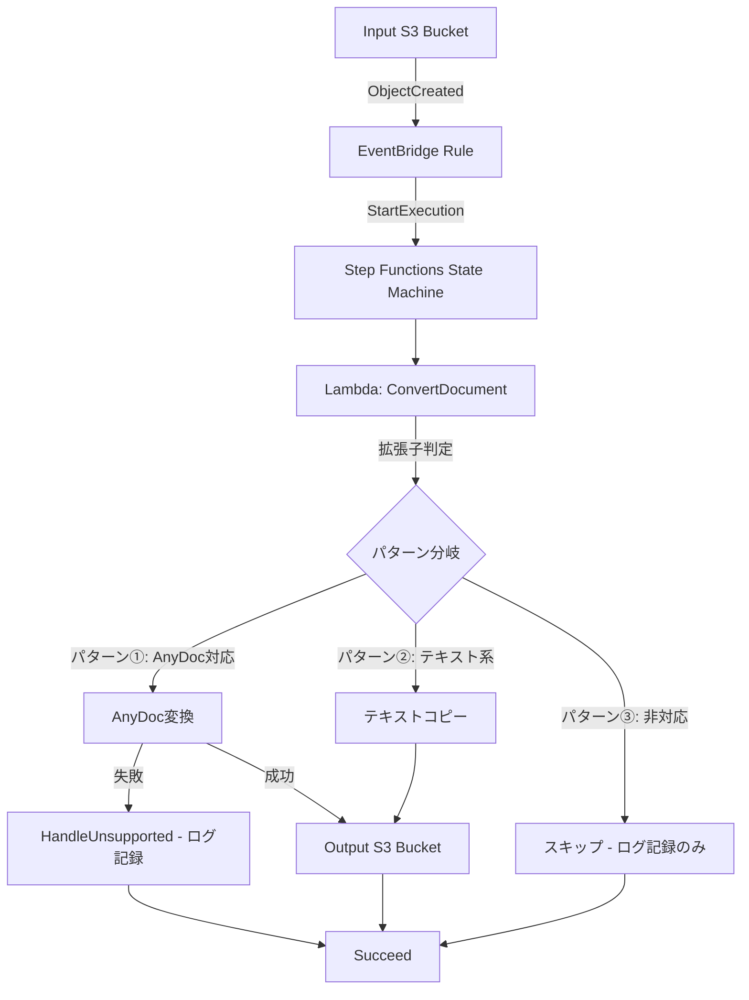
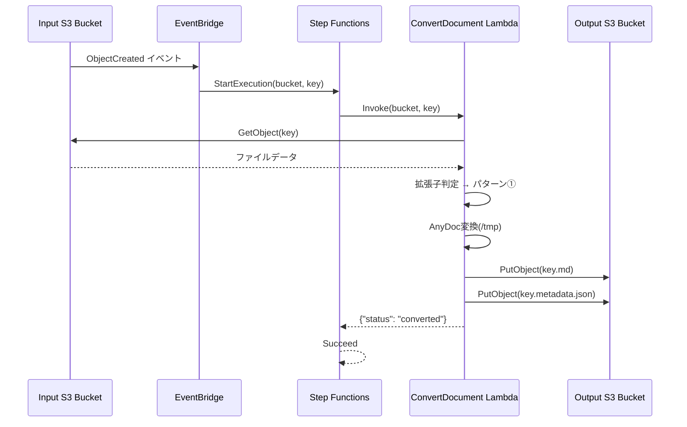
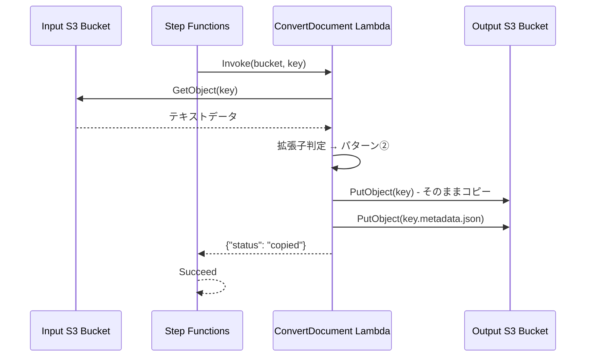
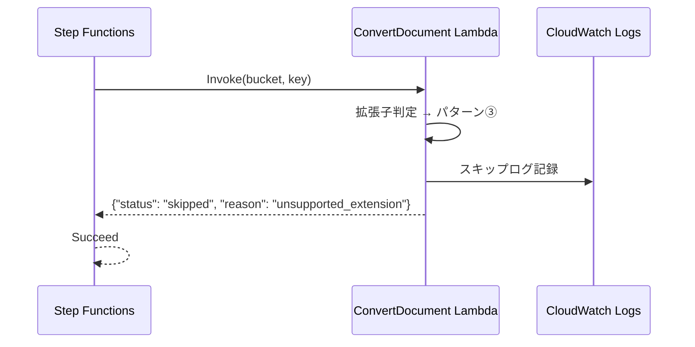

# 設計書: AnyDoc RAG前処理パイプライン

## 概要

RAG（Retrieval-Augmented Generation）のための文書前処理パイプラインを構築する。S3に配置された各種オフィス文書・PDF等を firecrawl/anydoc（Rust製、外部API/GPU不要のMarkdown変換ライブラリ）を用いてMarkdown化し、後続のRAGインデクシング処理が利用できる形でS3に格納する。

本パイプラインのスコープは「入力S3 → 変換 → 出力S3」までであり、Markdown化後のチャンク分割・Embedding化・ベクトルDB登録等はスコープ外とする。

## アーキテクチャ



### コンポーネント構成

| コンポーネント | 役割 |
|---|---|
| Input S3 Bucket | 変換対象の原本ファイルを格納 |
| EventBridge Rule | Input BucketへのPUT（Object Created）イベントを検知し、Step Functionsを起動 |
| Step Functions State Machine | 変換Lambdaの実行、成功/失敗の分岐、リトライ制御を行うオーケストレーション |
| Lambda: ConvertDocument | S3から原本を取得し、AnyDocで変換を試行。成功時はOutput Bucketへ結果をPUT |
| Output S3 Bucket | 変換済みMarkdownファイルおよびメタデータを格納 |

## シーケンス図

### メインフロー（パターン①: AnyDoc変換）



### パターン②: テキストコピー



### パターン③: スキップ



## コンポーネントとインターフェース

### Lambda: ConvertDocument

**目的**: 入力ファイルの分類と変換処理を一括で実行する

**インターフェース**:
```python
def lambda_handler(event: dict, context: LambdaContext) -> dict:
    """
    Args:
        event: Step Functions から渡されるイベント
            - detail.bucket.name: 入力バケット名
            - detail.object.key: オブジェクトキー
        context: Lambda実行コンテキスト

    Returns:
        dict: 処理結果
            - status: "converted" | "copied" | "skipped"
            - reason: (skipped時のみ) "unsupported_extension"
    """
    pass
```

**責務**:
- 拡張子に基づくファイル分類（3パターン）
- パターン①: AnyDoc変換 + 出力S3格納
- パターン②: テキストファイルのコピー + メタデータ生成
- パターン③: スキップ（ログ記録のみ）

### 分類関数

```python
from enum import Enum
from typing import Tuple

class FilePattern(Enum):
    ANYDOC_CONVERT = "convert"    # パターン①
    TEXT_COPY = "copy"            # パターン②
    SKIP = "skip"                 # パターン③

ANYDOC_EXTENSIONS = {
    ".doc", ".docx", ".docm",
    ".ppt", ".pps", ".pot", ".pptx", ".pptm", ".ppsx", ".ppsm",
    ".xls", ".xlsx", ".xlsm", ".xlsb",
    ".odt", ".ods", ".odp",
    ".rtf", ".epub", ".csv", ".pdf"
}

TEXT_EXTENSIONS = {".txt", ".md"}

def classify_file(object_key: str) -> FilePattern:
    """
    オブジェクトキーの拡張子に基づきファイルを3パターンに分類する。

    Preconditions:
        - object_key は空文字列でない
        - object_key はS3オブジェクトキーとして有効な文字列

    Postconditions:
        - 必ず FilePattern のいずれかの値を返す
        - 拡張子が ANYDOC_EXTENSIONS に含まれる場合は ANYDOC_CONVERT
        - 拡張子が TEXT_EXTENSIONS に含まれる場合は TEXT_COPY
        - それ以外の場合は SKIP
    """
    pass
```

### 変換関数

```python
import time
from dataclasses import dataclass

@dataclass
class ConversionResult:
    markdown_content: str
    source_key: str
    output_key: str
    metadata: dict
    duration_ms: int

def convert_document(bucket: str, key: str, output_bucket: str) -> ConversionResult:
    """
    AnyDocを使用してドキュメントをMarkdownに変換する。

    Preconditions:
        - bucket, key は有効なS3パス
        - 対象ファイルがパターン①（AnyDoc対応拡張子）である
        - firecrawl-anydoc ライブラリがインポート可能

    Postconditions:
        - 変換成功時: ConversionResult を返却
          - markdown_content は非空文字列
          - output_key は "{元キー}.md" 形式
          - metadata に source_bucket, source_key, converted_at, anydoc_version, file_size_bytes, conversion_duration_ms を含む
        - 変換失敗時: 例外をraise

    Loop Invariants: N/A
    """
    pass

def copy_text_file(bucket: str, key: str, output_bucket: str) -> dict:
    """
    テキストファイルをそのままOutput Bucketにコピーし、メタデータを生成する。

    Preconditions:
        - bucket, key は有効なS3パス
        - 対象ファイルがパターン②（.txt または .md）である

    Postconditions:
        - Output Bucketに元のキーで同一内容のファイルが格納される
        - Output Bucketに "{キー}.metadata.json" が格納される
        - 返却値の status は "copied"

    Loop Invariants: N/A
    """
    pass
```

### メタデータ生成関数

```python
from datetime import datetime, timezone

def generate_metadata(
    source_bucket: str,
    source_key: str,
    file_size_bytes: int,
    conversion_duration_ms: int = 0
) -> dict:
    """
    メタデータJSONの内容を生成する。

    Preconditions:
        - source_bucket, source_key は非空文字列
        - file_size_bytes >= 0
        - conversion_duration_ms >= 0

    Postconditions:
        - 返却値は以下のキーを全て含む dict:
          - "source_bucket": source_bucket と同一
          - "source_key": source_key と同一
          - "source_uri": "s3://{source_bucket}/{source_key}" 形式
          - "converted_at": ISO 8601 UTC形式の文字列
          - "anydoc_version": "0.1.9"
          - "file_size_bytes": file_size_bytes と同一
          - "conversion_duration_ms": conversion_duration_ms と同一

    Loop Invariants: N/A
    """
    pass
```

## データモデル

### メタデータJSON構造

```python
from dataclasses import dataclass
from datetime import datetime

@dataclass
class DocumentMetadata:
    source_bucket: str
    source_key: str
    source_uri: str          # "s3://{bucket}/{key}" 形式
    converted_at: str        # ISO 8601 UTC ("2026-08-14T12:34:56Z")
    anydoc_version: str      # "0.1.9" 固定
    file_size_bytes: int     # 元ファイルのサイズ
    conversion_duration_ms: int  # 変換所要時間(ms)、コピーの場合は0
```

**バリデーションルール**:
- `source_bucket`: 非空文字列、S3バケット名として有効
- `source_key`: 非空文字列、S3オブジェクトキーとして有効
- `source_uri`: `s3://` プレフィックスで始まる
- `converted_at`: ISO 8601形式
- `anydoc_version`: セマンティックバージョニング形式
- `file_size_bytes`: 0以上の整数
- `conversion_duration_ms`: 0以上の整数

### Lambda応答構造

```python
# パターン①: 変換成功
{"status": "converted"}

# パターン②: コピー成功
{"status": "copied"}

# パターン③: スキップ
{"status": "skipped", "reason": "unsupported_extension"}
```

### 出力キー命名規則

```python
def get_output_key(source_key: str, pattern: FilePattern) -> str:
    """
    入力キーから出力キーを生成する。

    パターン①: "{source_key}.md" (例: "docs/report.docx" → "docs/report.docx.md")
    パターン②: "{source_key}" (キーそのまま)
    パターン③: 出力なし (None)
    """
    pass

def get_metadata_key(output_key: str) -> str:
    """
    出力キーからメタデータキーを生成する。

    規則: "{output_key}.metadata.json"
    例: "docs/report.docx.md" → "docs/report.docx.md.metadata.json"
    例: "docs/notes.txt" → "docs/notes.txt.metadata.json"
    """
    pass
```

## Step Functions 状態マシン定義（ASL概要）

```python
# convert.asl.json の構造概要
STATE_MACHINE_DEFINITION = {
    "StartAt": "ConvertDocument",
    "States": {
        "ConvertDocument": {
            "Type": "Task",
            "Resource": "Lambda ARN",
            "Retry": [{
                "ErrorEquals": ["States.TaskFailed", "Lambda.ServiceException"],
                "IntervalSeconds": 2,
                "MaxAttempts": 3,
                "BackoffRate": 2.0
            }],
            "Catch": [{
                "ErrorEquals": ["States.ALL"],
                "Next": "HandleUnsupported"
            }],
            "Next": "Succeed"
        },
        "HandleUnsupported": {
            "Type": "Pass",
            "Result": {"status": "failed", "handled": True},
            "Next": "Succeed"
        },
        "Succeed": {
            "Type": "Succeed"
        }
    }
}
```

## エラーハンドリング

### エラーシナリオ1: AnyDoc変換失敗

**条件**: 暗号化ファイル、破損ファイル等でAnyDoc変換が例外を発生させた場合
**対応**: Lambda内で例外をraiseし、Step FunctionsのCatchで`HandleUnsupported`に遷移
**復旧**: ステートマシンは正常終了。CloudWatch Logsにエラー詳細を記録

### エラーシナリオ2: S3アクセスエラー（一時的）

**条件**: S3スロットリング、一時的なネットワークエラー
**対応**: Step FunctionsのRetry設定により自動リトライ（最大3回、指数バックオフ）
**復旧**: リトライ成功で通常処理続行。3回失敗でCatchへ遷移

### エラーシナリオ3: メタデータ格納失敗

**条件**: Markdown格納後にメタデータJSON格納が失敗した場合
**対応**: Markdownは格納済みのため、Lambda全体を失敗扱いにはしない。ログ出力のみ
**復旧**: 次回同一ファイルがPUTされた際に上書きで自然回復

### エラーシナリオ4: Lambda タイムアウト

**条件**: 大容量ファイルの変換が5分を超過した場合
**対応**: Lambda実行環境のタイムアウトで強制終了。Step FunctionsのCatchで捕捉
**復旧**: HandleUnsupported経由で正常終了。手動対応が必要な場合はログから判断

## テスト戦略

### ユニットテスト

- `classify_file()`: 各拡張子に対する分類結果の検証
- `generate_metadata()`: メタデータ構造の正確性検証
- `get_output_key()` / `get_metadata_key()`: キー生成ロジックの検証
- Lambda handler: モックを使用した正常/異常系のフロー検証

### インテグレーションテスト

- `sam local invoke` でのLambda単体実行テスト
- 実際のS3バケットを使用したEnd-to-Endテスト（テスト用スタック）

## パフォーマンス考慮事項

- **メモリ**: 1024MB（大容量PDF/Office文書の変換に対応）
- **タイムアウト**: 5分（数十MBファイルの変換を想定）
- **同時実行**: Reserved Concurrency = 10（大量一括PUTによるスロットリング防止）
- **一時ストレージ**: `/tmp` 512MB（Lambdaデフォルト）
- **ファイルサイズ上限**: 数十MB以下を想定

## セキュリティ考慮事項

- **暗号化**: SSE-S3（S3管理キーによるデフォルト暗号化）
- **IAM最小権限**:
  - Lambda → Input Bucket: `s3:GetObject` のみ
  - Lambda → Output Bucket: `s3:PutObject` のみ
  - EventBridge → Step Functions: `states:StartExecution` のみ
- **ネットワーク**: VPC外で実行（S3アクセスのみのため）

## 依存関係

| パッケージ | バージョン | 用途 |
|---|---|---|
| firecrawl-anydoc | 0.1.9 | ドキュメントからMarkdownへの変換 |
| boto3 | Lambda Runtime提供 | AWS SDK (S3操作) |
| AWS SAM CLI | 最新 | IaCデプロイツール |

## 正確性プロパティ

*プロパティとは、システムの全ての有効な実行において真であるべき特性・振る舞いの形式的な記述であり、人間が読める仕様と機械で検証可能な正確性保証を橋渡しする。*

### Property 1: ファイル分類の完全性と正確性

*任意の* S3オブジェクトキーに対して、`classify_file()` は必ず `FilePattern` のいずれかの値（ANYDOC_CONVERT, TEXT_COPY, SKIP）を返し、未分類の状態にはならない。かつ、ANYDOC_EXTENSIONS に含まれる拡張子はパターン①に、TEXT_EXTENSIONS に含まれる拡張子はパターン②に、それ以外はパターン③に分類される。

**Validates: Requirements 2.1, 2.2, 2.3, 2.4**

### Property 2: ファイル分類の決定性

*任意の* オブジェクトキーに対して、`classify_file()` を複数回呼び出しても常に同一の `FilePattern` を返す（決定的な動作）

**Validates: Requirements 2.5**

### Property 3: 出力キー命名の非衝突性

*任意の* 異なる入力キーのペアに対して、同一パターンであれば `get_output_key()` の結果も異なる（キーの衝突が発生しない）

**Validates: Requirements 7.1, 7.2, 7.3**

### Property 4: メタデータ構造の完全性

*任意の* 有効な入力パラメータ（source_bucket, source_key, file_size_bytes, conversion_duration_ms）に対して、`generate_metadata()` は必ず全ての必須フィールド（source_bucket, source_key, source_uri, converted_at, anydoc_version, file_size_bytes, conversion_duration_ms）を含むdictを返す

**Validates: Requirements 6.1**

### Property 5: メタデータのsource_uriフォーマット整合性

*任意の* source_bucket と source_key の組み合わせに対して、`generate_metadata()` が返す `source_uri` は `"s3://{source_bucket}/{source_key}"` の形式と一致する

**Validates: Requirements 6.2**

### Property 6: メタデータのconverted_at形式

*任意の* 有効な入力パラメータに対して、`generate_metadata()` が返す `converted_at` はISO 8601 UTC形式の文字列である

**Validates: Requirements 6.3**
