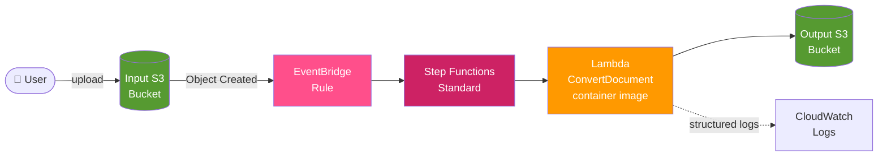
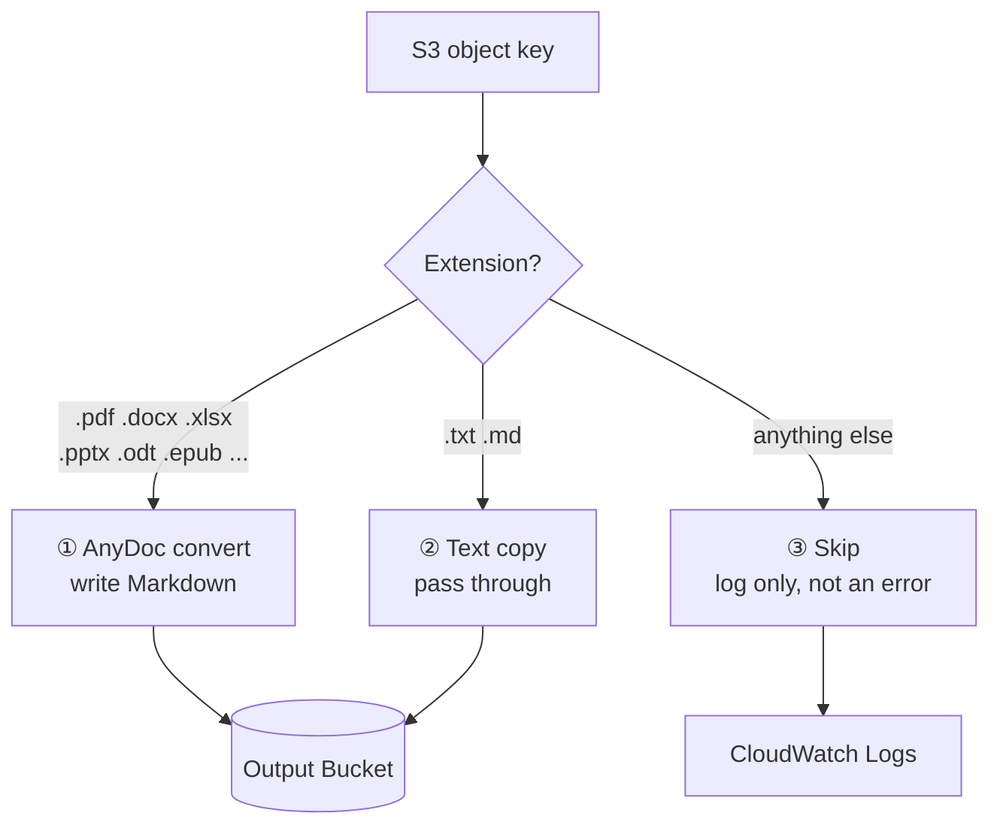

# AnyDoc RAG Preprocessor

[](https://github.com/akira-sato22/anydoc-rag-preprocessor/actions/workflows/ci.yml)
[](LICENSE)
[](https://www.python.org/)
[](https://aws.amazon.com/serverless/sam/)

**Drop a file into S3, get clean Markdown out.** A serverless pipeline that handles the document-preprocessing stage of a RAG system.

No external conversion API, no GPU. Conversion runs entirely inside a Lambda container using [firecrawl/anydoc](https://github.com/firecrawl/anydoc) — a Rust library — so **your internal documents never leave your AWS account**.

> 🇯🇵 日本語版: [README.md](README.md)

---

## Why this exists

The least glamorous and most tedious part of building a RAG system is turning a pile of `.docx` and `.pdf` files into decent text. Three problems come up every time:

| Common problem | How this pipeline answers it |
|---|---|
| You don't want to ship internal documents to a third-party API | Conversion happens in Lambda inside your own AWS account. Zero outbound data |
| Docker + OCR + GPU makes the stack heavy | anydoc is a single Rust library. No GPU, runs in 512MB of Lambda memory |
| One bad file breaks the whole batch | Files are routed by extension into three paths; unsupported files are skipped, not swallowed as errors |

Chunking, embedding, and vector-store ingestion are **out of scope**. This pipeline covers "source file → clean Markdown + metadata"; what happens after that is up to you.

---

## Architecture



The Lambda looks only at the object key's extension and branches three ways:



A Step Functions Standard workflow wraps the Lambda and retries `States.TaskFailed` / `Lambda.ServiceException` **up to 3 times with exponential backoff (2s → 4s → 8s)**. If it still fails, execution falls through to `HandleUnsupported`, returns `status: failed, handled: true`, and **the state machine finishes successfully** — one corrupt file doesn't leave a permanent red mark in your execution history.

---

## Supported formats

| Pattern | Extensions | Behavior |
|---|---|---|
| ① AnyDoc convert | `.doc` `.docx` `.docm` `.ppt` `.pps` `.pot` `.pptx` `.pptm` `.ppsx` `.ppsm` `.xls` `.xlsx` `.xlsm` `.xlsb` `.odt` `.ods` `.odp` `.rtf` `.epub` `.csv` `.pdf` | Converted to Markdown, written to the output bucket |
| ② Text copy | `.txt` `.md` | Copied to the output bucket as-is |
| ③ Skip | everything else (`.jpg`, `.zip`, …) | One structured log line. No output, no error |

Extension matching is **case-insensitive** — `REPORT.PDF` is treated as pattern ①.

---

## Quick start

### Prerequisites

- [AWS SAM CLI](https://docs.aws.amazon.com/serverless-application-model/latest/developerguide/install-sam-cli.html)
- [Docker](https://www.docker.com/) (required to build the Lambda container image)
- AWS CLI with configured credentials
- Python 3.12+ (only to run the tests)

### 1. Create an ECR repository

The Lambda runs as a container image, so it needs somewhere to live.

```bash
aws ecr create-repository \
  --repository-name anydoc-rag-preprocessor/convert-document \
  --region ap-northeast-1
```

### 2. Edit `samconfig.toml`

Replace `<AWS_ACCOUNT_ID>` with your own 12-digit AWS account ID.

```toml
image_repositories = ["ConvertDocumentFunction=123456789012.dkr.ecr.ap-northeast-1.amazonaws.com/anydoc-rag-preprocessor/convert-document"]
```

> Deploying outside `ap-northeast-1`? Change both the `region` in `samconfig.toml` and the ECR URI above.

### 3. Build and deploy

```bash
sam build
sam deploy
```

Use `sam deploy --guided` on the first run to set the stack name, region, and parameters interactively.

### 4. Throw a file at it

```bash
INPUT_BUCKET=$(aws cloudformation describe-stacks \
  --stack-name anydoc-rag-preprocessor \
  --query 'Stacks[0].Outputs[?OutputKey==`InputBucketName`].OutputValue' \
  --output text)

aws s3 cp ./document.pdf s3://$INPUT_BUCKET/documents/
```

Seconds later, the results appear in the output bucket:

```bash
OUTPUT_BUCKET=$(aws cloudformation describe-stacks \
  --stack-name anydoc-rag-preprocessor \
  --query 'Stacks[0].Outputs[?OutputKey==`OutputBucketName`].OutputValue' \
  --output text)

aws s3 ls s3://$OUTPUT_BUCKET/documents/
# documents/document.pdf.md
# documents/document.pdf.md.metadata.json
```

---

## Output contract

### Key naming

`.md` is appended **while keeping the original extension**, so `report.docx` and `report.pdf` in the same prefix never collide.

| Input key | Output key | Metadata key |
|---|---|---|
| `docs/report.docx` | `docs/report.docx.md` | `docs/report.docx.md.metadata.json` |
| `docs/report.pdf` | `docs/report.pdf.md` | `docs/report.pdf.md.metadata.json` |
| `docs/notes.txt` | `docs/notes.txt` | `docs/notes.txt.metadata.json` |

### Metadata JSON

A `.metadata.json` sidecar sits next to each converted Markdown file. Use it downstream to attach a source URI to every chunk.

```json
{
  "source_bucket": "anydoc-rag-preprocessor-input",
  "source_key": "documents/document.pdf",
  "source_uri": "s3://anydoc-rag-preprocessor-input/documents/document.pdf",
  "converted_at": "2026-08-15T10:30:00Z",
  "anydoc_version": "0.1.9",
  "file_size_bytes": 1048576,
  "conversion_duration_ms": 2500
}
```

If the metadata write fails, the run still **succeeds** — the Markdown itself is already stored — and a warning is logged. Losing a sidecar should never cost you the document.

### Idempotency

Re-uploading a file under the same key **overwrites** the Markdown and its metadata. S3 versioning is not enabled.

---

## Configuration

### CloudFormation parameters

| Parameter | Default | Description |
|---|---|---|
| `Environment` | `dev` | One of `dev` / `staging` / `prod`. Used for tagging |
| `Project` | `anydoc-rag` | Project name. Used for tagging |

Override them from `samconfig.toml`:

```toml
parameter_overrides = "Environment=\"prod\" Project=\"my-project\""
```

### Infrastructure settings

| Item | Value |
|---|---|
| Lambda memory | 512 MB |
| Lambda timeout | 300 s (5 min) |
| Lambda concurrency | Shared account pool (no reserved concurrency) |
| S3 encryption | SSE-S3 (AES256), both buckets |
| Step Functions | Standard (full execution history) |
| Retry | 3 attempts, exponential backoff 2s / 4s / 8s |

> [!IMPORTANT]
> **Revisit these before production use.** The design calls for **1024 MB memory and a reserved concurrency of 10**, but the values here were lowered to fit the Service Quotas of the development account used to build this. On an unconstrained account, set `MemorySize` back to `1024` in `template.yaml` and add `ReservedConcurrentExecutions: 10`. Without reserved concurrency, a large batch upload can starve other Lambda functions in the same account.

### IAM permissions

The Lambda holds exactly two permissions:

- `s3:GetObject` on the input bucket (SAM's `S3ReadPolicy`)
- `s3:PutObject` scoped to objects under the output bucket

It cannot read the output bucket, and it cannot touch any other bucket.

---

## Cost

Everything is pay-per-use, so **idle cost is essentially just S3 storage**. Unit prices vary by region and change over time — check the [AWS Pricing Calculator](https://calculator.aws/) for real numbers — but the order of magnitude looks like this.

Processing 1,000 files (1 MB average, 2.5 s conversion, 512 MB Lambda):

| Service | Billed for | Rough cost |
|---|---|---|
| Lambda | 1,250 GB-seconds + 1,000 requests | a few cents |
| Step Functions | ~3,000 state transitions | low tens of cents |
| S3 | PUT/GET plus storage | a few cents |
| ECR | Image storage (a few hundred MB) | a few cents / month |

Expect **well under $1 per 1,000 files**. State transitions dominate, so for very high volumes, switching to Express Workflows is the lever that matters (see [Roadmap](#roadmap)).

---

## Development

### Tests

```bash
pip install -r tests/requirements-test.txt
pytest
```

**16 property tests + 8 unit tests = 24 total.**

The property tests use [hypothesis](https://hypothesis.readthedocs.io/) to verify the *properties* of the logic rather than hand-picked examples.

| Test file | Property verified |
|---|---|
| `tests/property/test_classify_file.py` | Classification is deterministic, case-insensitive, and total (every input lands in exactly one pattern) |
| `tests/property/test_output_key.py` | Distinct input keys always produce distinct output keys (no collisions) |
| `tests/property/test_metadata.py` | All required fields present, `source_uri` well-formed, `converted_at` is valid ISO 8601 |

### Validating the template

```bash
sam validate --lint
```

CI runs the equivalent check with [cfn-lint](https://github.com/aws-cloudformation/cfn-lint), which needs no AWS credentials.

### Layout

```
.
├── template.yaml                  # SAM template (IaC)
├── samconfig.toml                 # SAM CLI deploy config
├── statemachine/
│   └── convert.asl.json           # Step Functions ASL definition
├── src/convert_document/
│   ├── app.py                     # Lambda function code
│   ├── Dockerfile                 # Container image definition
│   └── requirements.txt           # Python dependencies
├── tests/
│   ├── property/                  # Property tests (hypothesis)
│   └── unit/                      # Unit tests
├── DESIGN.md                      # Detailed design document (Japanese)
└── .kiro/specs/                   # Requirements, design, and task breakdown (Japanese)
```

---

## Limitations

Stated plainly:

- **Lambda's `/tmp` is 512 MB.** Very large files (hundreds of MB of PDF) will fail.
- **The timeout is 5 minutes.** Long PDFs can hit it.
- **No OCR.** Scanned, image-only PDFs yield no text. Pair this with Amazon Textract if that's your corpus.
- **Encrypted or corrupt files fail conversion.** After 3 retries they're caught by `HandleUnsupported` and recorded in CloudWatch Logs.
- **Conversion quality depends on anydoc.** Complex tables and multi-column layouts may not translate cleanly to Markdown.
- **No alerting.** Add a CloudWatch Logs metric filter plus SNS if you need to be told about failures.

## Roadmap

- [ ] SNS / Slack notification on failure
- [ ] Step Functions Express Workflow option for high-volume batches
- [ ] OCR fallback for image-only PDFs (Amazon Textract)
- [ ] Lifecycle policy on the output bucket
- [ ] Sample extension covering chunking and embedding

Suggestions via issues and pull requests are welcome.

---

## Teardown

```bash
# Empty the buckets first — CloudFormation cannot delete non-empty buckets
aws s3 rm s3://$INPUT_BUCKET --recursive
aws s3 rm s3://$OUTPUT_BUCKET --recursive

sam delete --stack-name anydoc-rag-preprocessor
```

The ECR repository is managed outside the stack; delete it separately if you no longer need it.

---

## Contributing

Bug reports, feature ideas, and pull requests are all welcome — see [CONTRIBUTING.md](CONTRIBUTING.md). Participation is governed by the [Code of Conduct](CODE_OF_CONDUCT.md).

Found a security issue? Please follow [SECURITY.md](SECURITY.md) instead of opening a public issue.

## License

[MIT License](LICENSE)

## Acknowledgements

Conversion is powered by [firecrawl/anydoc](https://github.com/firecrawl/anydoc). Having a Rust library that needs neither an external API nor a GPU is what made this architecture possible.
