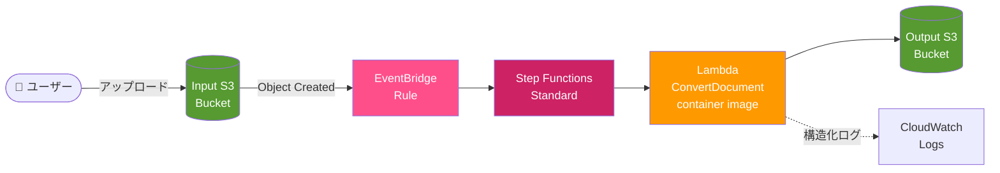
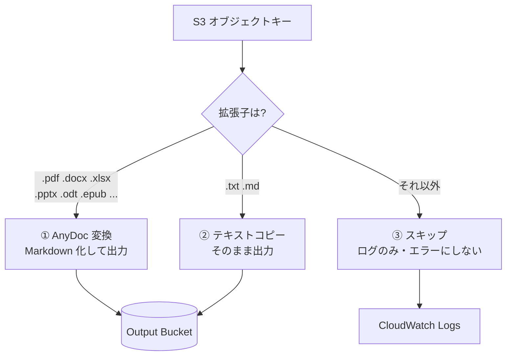

# AnyDoc RAG Preprocessor

[](https://github.com/akira-sato22/anydoc-rag-preprocessor/actions/workflows/ci.yml)
[](LICENSE)
[](https://www.python.org/)
[](https://aws.amazon.com/serverless/sam/)

**S3 にファイルを置くだけで、Office 文書・PDF が Markdown になって出てくる。** RAG のインデクシング前処理をまるごと引き受けるサーバーレスパイプラインです。

外部の変換 API も GPU も使いません。変換は Rust 製の [firecrawl/anydoc](https://github.com/firecrawl/anydoc) が Lambda コンテナの中で完結させるので、**社内文書を外部サービスに送らずに済みます**。

> 🇬🇧 English version: [README.en.md](README.en.md)

---

## なぜ作ったか

RAG を作るとき、いちばん地味で、いちばん面倒なのが「手元の .docx や .pdf の山を、まともなテキストにする」工程です。ここでよくある悩みが3つあります。

| よくある悩み | このパイプラインの答え |
|---|---|
| 変換 API に社内文書を投げたくない | 変換処理は自分の AWS アカウント内の Lambda で完結。外部への送信ゼロ |
| Docker + OCR + GPU で構成が重くなる | anydoc は Rust 製の単一ライブラリ。GPU 不要、Lambda 512MB で動く |
| 変換の失敗が後続処理を全部止める | 拡張子で3分岐し、非対応ファイルは「握りつぶさずスキップ」。1ファイルの失敗がパイプライン全体を止めない |

チャンク分割・Embedding・ベクトル DB への登録は**スコープ外**です。このパイプラインは「原本 → クリーンな Markdown + メタデータ」までを担当し、その先は好きな構成に繋げられます。

---

## アーキテクチャ



Lambda は受け取ったオブジェクトキーの拡張子だけを見て、3つの経路に分岐します。



Step Functions（Standard）が Lambda の実行を包み、`States.TaskFailed` / `Lambda.ServiceException` に対して**最大3回・指数バックオフ（2s → 4s → 8s）**でリトライします。それでも失敗した場合は `HandleUnsupported` ステートに落ちて `status: failed, handled: true` を返し、**ステートマシン自体は成功で終了**します。壊れた1ファイルのために実行履歴が赤くなり続けることはありません。

---

## 対応フォーマット

| パターン | 拡張子 | 処理内容 |
|---|---|---|
| ① AnyDoc 変換 | `.doc` `.docx` `.docm` `.ppt` `.pps` `.pot` `.pptx` `.pptm` `.ppsx` `.ppsm` `.xls` `.xlsx` `.xlsm` `.xlsb` `.odt` `.ods` `.odp` `.rtf` `.epub` `.csv` `.pdf` | Markdown へ変換して出力 S3 に格納 |
| ② テキストコピー | `.txt` `.md` | 変換せずそのまま出力 S3 にコピー |
| ③ スキップ | 上記以外（`.jpg` `.zip` など） | 構造化ログを1行残すのみ。出力なし・エラーなし |

拡張子の判定は**大文字小文字を区別しません**（`REPORT.PDF` も ① として扱われます）。

---

## クイックスタート

### 前提条件

- [AWS SAM CLI](https://docs.aws.amazon.com/serverless-application-model/latest/developerguide/install-sam-cli.html)
- [Docker](https://www.docker.com/)（Lambda コンテナイメージのビルドに必要）
- AWS CLI（認証情報設定済み）
- Python 3.12+（テストを動かす場合）

### 1. ECR リポジトリを作る

Lambda 関数はコンテナイメージで動くため、イメージの置き場が必要です。

```bash
aws ecr create-repository \
  --repository-name anydoc-rag-preprocessor/convert-document \
  --region ap-northeast-1
```

### 2. `samconfig.toml` を編集する

`<AWS_ACCOUNT_ID>` を自分の 12 桁の AWS アカウント ID に置き換えます。

```toml
image_repositories = ["ConvertDocumentFunction=123456789012.dkr.ecr.ap-northeast-1.amazonaws.com/anydoc-rag-preprocessor/convert-document"]
```

> 東京以外のリージョンを使う場合は、`samconfig.toml` の `region` と上記 ECR URI の両方を書き換えてください。

### 3. ビルドしてデプロイする

```bash
sam build
sam deploy
```

初回は `sam deploy --guided` を使うと、スタック名・リージョン・パラメータを対話的に決められます。

### 4. ファイルを投げ込む

```bash
INPUT_BUCKET=$(aws cloudformation describe-stacks \
  --stack-name anydoc-rag-preprocessor \
  --query 'Stacks[0].Outputs[?OutputKey==`InputBucketName`].OutputValue' \
  --output text)

aws s3 cp ./document.pdf s3://$INPUT_BUCKET/documents/
```

数秒〜数十秒後、Output Bucket に結果が出ています。

```bash
OUTPUT_BUCKET=$(aws cloudformation describe-stacks \
  --stack-name anydoc-rag-preprocessor \
  --query 'Stacks[0].Outputs[?OutputKey==`OutputBucketName`].OutputValue' \
  --output text)

aws s3 ls s3://$OUTPUT_BUCKET/documents/
# documents/document.pdf.md
# documents/document.pdf.md.metadata.json
```

---

## 出力仕様

### ファイル名規則

**元の拡張子を残したまま** `.md` を付けます。`report.docx` と `report.pdf` が同じプレフィックスにあっても出力が衝突しないための設計です。

| 入力キー | 出力キー | メタデータキー |
|---|---|---|
| `docs/report.docx` | `docs/report.docx.md` | `docs/report.docx.md.metadata.json` |
| `docs/report.pdf` | `docs/report.pdf.md` | `docs/report.pdf.md.metadata.json` |
| `docs/notes.txt` | `docs/notes.txt` | `docs/notes.txt.metadata.json` |

### メタデータ JSON

変換済み Markdown と同じプレフィックスに `.metadata.json` を並べて置きます。後続のインデクシング処理で、チャンクに出典 URI を持たせるのに使えます。

```json
{
  "source_bucket": "anydoc-rag-preprocessor-input",
  "source_key": "documents/document.pdf",
  "source_uri": "s3://anydoc-rag-preprocessor-input/documents/document.pdf",
  "converted_at": "2026-08-15T10:30:00Z",
  "anydoc_version": "0.1.9",
  "file_size_bytes": 1048576,
  "conversion_duration_ms": 2500
}
```

メタデータの書き込みに失敗しても、**本体の Markdown は既に格納済みなので処理は成功扱い**にし、警告ログだけを残します（メタデータの欠損で本文を失わないため）。

### 冪等性

同じキーのファイルが再アップロードされた場合、出力 Markdown とメタデータは**上書き**されます。S3 バージョニングは有効化していません。

---

## 設定

### CloudFormation パラメータ

| パラメータ | デフォルト | 説明 |
|---|---|---|
| `Environment` | `dev` | `dev` / `staging` / `prod`。タグに使用 |
| `Project` | `anydoc-rag` | プロジェクト名。タグに使用 |

`samconfig.toml` から上書きできます。

```toml
parameter_overrides = "Environment=\"prod\" Project=\"my-project\""
```

### インフラ構成

| 項目 | 設定値 |
|---|---|
| Lambda メモリ | 512 MB |
| Lambda タイムアウト | 300 秒（5分） |
| Lambda 同時実行数 | アカウント共有プール（Reserved 未設定） |
| S3 暗号化 | SSE-S3 (AES256)、入出力とも |
| Step Functions | Standard（全実行履歴を記録） |
| リトライ | 最大3回、指数バックオフ 2s / 4s / 8s |

> [!IMPORTANT]
> **本番運用では値の見直しを推奨します。** 設計上の推奨値は **メモリ 1024MB・Reserved Concurrency 10** ですが、開発に使ったアカウントの Service Quotas 制約（メモリ上限 512MB、同時実行数上限 10 程度）に合わせて現在の値に落としてあります。制約のないアカウントにデプロイする場合は、`template.yaml` の `MemorySize` を `1024` に戻し、`ReservedConcurrentExecutions: 10` を追加してください。大量のファイルを一度に投入すると、Reserved Concurrency 未設定のままではアカウント内の他の Lambda を圧迫する可能性があります。

### IAM 権限

Lambda に付与しているのは最小限の2つだけです。

- Input Bucket に対する `s3:GetObject`（SAM の `S3ReadPolicy`）
- Output Bucket 配下に対する `s3:PutObject`

出力バケットへの読み取り権限も、他バケットへのアクセス権限も持ちません。

---

## コスト感

すべて従量課金で、**アイドル時のコストはほぼ S3 のストレージ代のみ**です。実際の単価はリージョンと時期で変わるため、[AWS Pricing Calculator](https://calculator.aws/) での試算を推奨しますが、桁感としては以下の通りです。

1,000 ファイル（平均 1MB、変換 2.5 秒、Lambda 512MB）を処理した場合:

| サービス | 課金対象 | 概算 |
|---|---|---|
| Lambda | 1,250 GB-秒 + 1,000 リクエスト | 数セント |
| Step Functions | 約 3,000 state transitions | 十数セント |
| S3 | 入出力の PUT/GET + 保管 | 数セント |
| ECR | イメージ保管（数百 MB） | 月数セント |

**合計で 1,000 ファイルあたり 1 ドル未満**が目安です。支配的なのは Step Functions の state transition 課金なので、超大量処理では Express Workflow への切り替えが効きます（[ロードマップ](#ロードマップ)参照）。

---

## 開発

### テスト

```bash
pip install -r tests/requirements-test.txt
pytest
```

**プロパティテスト 16件 + ユニットテスト 8件 = 計 24件**が走ります。

[hypothesis](https://hypothesis.readthedocs.io/) によるプロパティテストで、ロジックの「性質」そのものを検証しています。

| テストファイル | 検証している性質 |
|---|---|
| `tests/property/test_classify_file.py` | 分類の決定性（同じ入力は常に同じ結果）・大文字小文字非依存・全入力がいずれかのパターンに落ちる網羅性 |
| `tests/property/test_output_key.py` | 異なる入力キーからは必ず異なる出力キーが生成される（非衝突性） |
| `tests/property/test_metadata.py` | 全必須フィールドの存在・`source_uri` の形式・`converted_at` の ISO 8601 準拠 |

### テンプレートの検証

```bash
sam validate --lint
```

CI では認証情報不要な [cfn-lint](https://github.com/aws-cloudformation/cfn-lint) を使って同等のチェックをしています。

### プロジェクト構成

```
.
├── template.yaml                  # SAM テンプレート (IaC)
├── samconfig.toml                 # SAM CLI デプロイ設定
├── statemachine/
│   └── convert.asl.json           # Step Functions ASL 定義
├── src/convert_document/
│   ├── app.py                     # Lambda 関数コード
│   ├── Dockerfile                 # コンテナイメージ定義
│   └── requirements.txt           # Python 依存関係
├── tests/
│   ├── property/                  # プロパティテスト (hypothesis)
│   └── unit/                      # ユニットテスト
├── DESIGN.md                      # 詳細設計書
└── .kiro/specs/                   # 要件・設計・タスクの仕様書
```

より詳しい設計判断の背景は **[DESIGN.md](DESIGN.md)** に、要件定義から実装タスクへの分解は **[.kiro/specs/](.kiro/specs/anydoc-rag-preprocessor/)** にあります。

---

## 制限事項

正直に書いておきます。

- **Lambda の /tmp は 512MB**。極端に大きなファイル（数百 MB 級の PDF など）は失敗します。
- **タイムアウトは 5 分**。ページ数の多い PDF はここに引っかかる可能性があります。
- **OCR はしません**。スキャン画像だけの PDF からはテキストが取れません。画像 PDF が主なら、別途 Amazon Textract 等との組み合わせが必要です。
- **暗号化・破損ファイルは変換に失敗**します。3回リトライした後 `HandleUnsupported` で握られ、CloudWatch Logs に記録されます。
- **変換品質は anydoc に依存**します。複雑なレイアウトの表や段組みは、期待通りに Markdown 化されないことがあります。
- **通知はありません**。失敗を検知したい場合は CloudWatch Logs のメトリクスフィルタ + SNS を追加してください。

## ロードマップ

- [ ] 失敗時の SNS / Slack 通知
- [ ] 大量処理向けの Step Functions Express Workflow オプション
- [ ] 画像 PDF 向けの OCR フォールバック（Amazon Textract）
- [ ] Output Bucket のライフサイクルポリシー
- [ ] チャンク分割・Embedding までを含むサンプル拡張

Issue や Pull Request でのご提案を歓迎します。

---

## 片付け

```bash
# 先にバケットを空にする（CloudFormation はオブジェクトが残っていると削除に失敗します）
aws s3 rm s3://$INPUT_BUCKET --recursive
aws s3 rm s3://$OUTPUT_BUCKET --recursive

sam delete --stack-name anydoc-rag-preprocessor
```

ECR リポジトリはスタック管理外なので、不要なら別途削除してください。

---

## コントリビュート

バグ報告・機能提案・Pull Request すべて歓迎です。詳しくは [CONTRIBUTING.md](CONTRIBUTING.md) をご覧ください。参加にあたっては [行動規範](CODE_OF_CONDUCT.md) に従ってください。

セキュリティ上の問題を見つけた場合は、公開 Issue ではなく [SECURITY.md](SECURITY.md) の手順に従ってご連絡ください。

## ライセンス

[MIT License](LICENSE)

## 謝辞

変換エンジンとして [firecrawl/anydoc](https://github.com/firecrawl/anydoc) を使わせてもらっています。外部 API も GPU も要らない Rust 製ライブラリという選択肢があったからこそ、この構成が成立しました。
